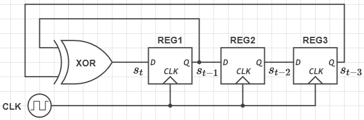
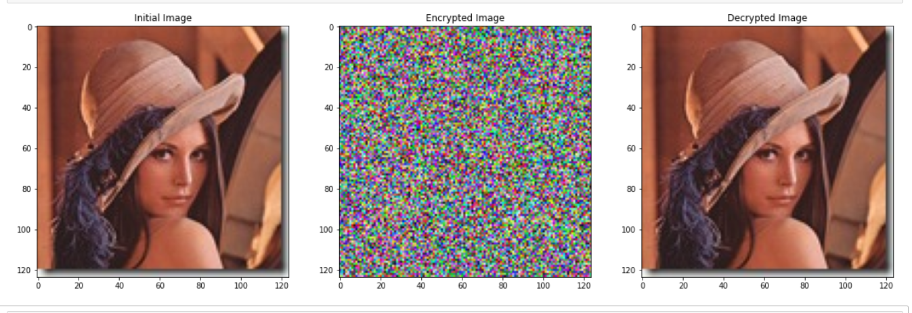

### Table of Contents

- **[Introduction](#introduction)**
- **[Dependencies](#dependencies)**
- **[Results](#results)**
- **[Bibliography](#bibliography)**

## Introduction

Linear feedback shift register(**LFSR**) is a digital circuit composed of linked registers .
 
Shifting the LFSR left/right with one bit and replacing the lost bit in a deterministic 
manner with respect to some bits of the previous state creates this mechanism of pseudo 
random bit generation.
 ls

 
In this example the new bit value is the result of the XOR operation between the value
of the first register and the third.
 

The **initial state** of the LFSR and the **registers who contribute** at computing the next bit
are **the seed** of the generator.

 
The LFSR state will at some point repeat duo to its linear nature thus the sequence generated by it
will repeat.
 

Choosing **the seed** seed is an important part of construction an LFSR. It dictates **the length
of the non-repeating sequence** and **sequence randomness degree**.

Linear feedback shift registers are good pseudo random bit generators due to the next reasons:
1) Long non-repeating sequences close to 2^n for an LFSR constructed of N registers.
2) Good bit randomness.

## Dependencies

1) **pillow** for image manipulation 
2) **numpy** for some operations
3) **matplotlib** for plotting images

## Results

## Bibliography

https://ieeexplore.ieee.org/stamp/stamp.jsp?tp=&arnumber=9143052
